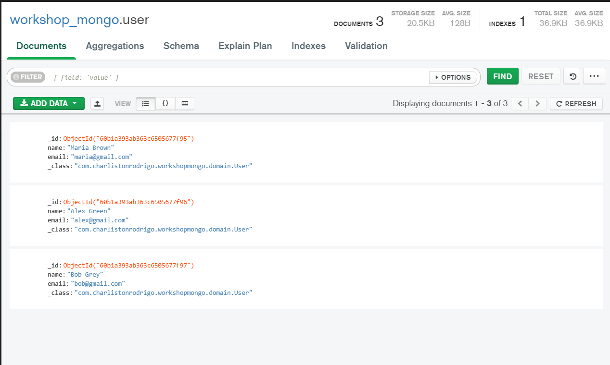

# workshop-spring-boot-mongodb

## Sobre 

Este e um aplicativo de funcionalidades de CRUD,onde especificamente insere um usuário e um e-mail .Este projeto faz parte do conteúdo de aprendizagem do bootcamp DevSuperior.
Este projeto foi criado com o framework spring e também banco de dados noSql mongoDB. Foi também construido dentro dos principios do rest e padrões de camadas.

## Layout

  

